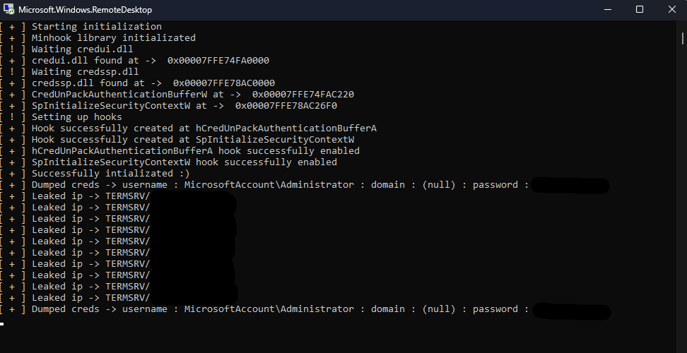

# Rdp credentials stealer

The project implements the technique of capturing rdp client authorization data ( mstsc.exe ) by setting hooks on CredUnPackAuthenticationBufferA/W and SpInitializeSecurityContextW functions.

# How to use

1. Compile the project through visual studio
2. Inject the dll library with any injector into the ```mstsc.exe`` process.
3. Authorize on the server

# Output



# Special thanks 

[TsudaKageyu](https://github.com/TsudaKageyu/minhook) - minhook hooking library

